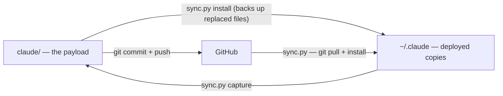
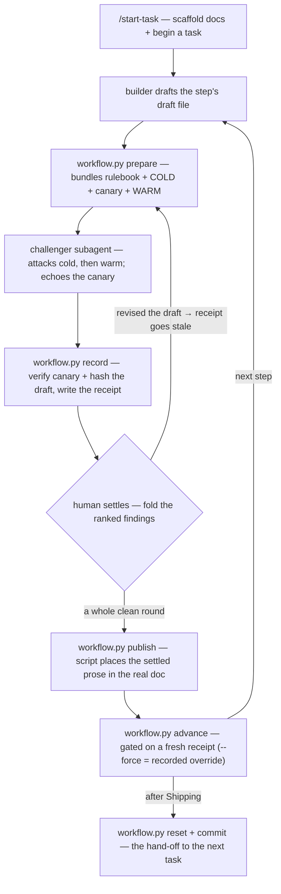

# Claude working-methodology — a portable, self-running discipline for coding with AI

My personal Claude Code working methodology, packaged so it deploys to any machine —
**Windows, macOS, or Linux** — with one command. This repo is the **source of truth** for the
files that live in `~/.claude` (`%USERPROFILE%\.claude` on Windows, `$HOME/.claude` elsewhere).

It has **two halves**:

1. **An always-on core** — six invariants + an OODA loop that hold on *every* project and machine,
   so the agent asks before building, assumes nothing, documents the *why*, keeps docs in sync,
   proves its work, and writes in a clear, plain, active style.
2. **An opt-in six-step adversarial workflow** — machinery that makes those rules actually *run* on a
   task: a second AI (the *challenger*) attacks each step before it settles, a deterministic script
   gates progress on a real challenge, and the project's docs write themselves as you go.

The only requirement is **Python 3** (already on most machines — nothing to `pip install`). Current
version **0.5.2** — pre-1.0 on purpose: this is a *living hypothesis*, revised when a rule misfires.

---

## Contents

- [Why this exists — the value](#why-this-exists--the-value)
- [What it is — the two halves](#what-it-is--the-two-halves)
- [How it all connects — the architecture](#how-it-all-connects--the-architecture)
- [The always-on core — six invariants + OODA](#the-always-on-core--six-invariants--ooda)
- [The docs it creates in your projects](#the-docs-it-creates-in-your-projects)
- [The six-step adversarial workflow](#the-six-step-adversarial-workflow)
- [Install & use — the commands](#install--use--the-commands)
- [Repository layout](#repository-layout)
- [Weak points & known limitations (the full list)](#weak-points--known-limitations-the-full-list)
- [Roadmap — what's next](#roadmap--whats-next)
- [For developers — working on the methodology itself](#for-developers--working-on-the-methodology-itself)
- [Notes & gotchas](#notes--gotchas)

---

## Why this exists — the value

Coding agents (and people in a hurry) tend to fail the same few ways: they start building before the
task is understood, make silent assumptions, leave the *why* behind a change undocumented, let the
docs drift out of sync with the code, and never say up front what "done" looks like. Each one quietly
costs a rebuild later.

This methodology is a small, fixed set of rules that heads those off — and, because it's deployed into
`~/.claude`, it holds on **every** project and **every** machine, not just the one where you happened
to feel disciplined. Concretely, it buys four things:

- **Better agent output** — less rework, because the agent asks first, assumes nothing, and verifies
  its own work instead of confidently shipping the wrong thing.
- **A project that explains itself** — decisions and docs are captured as you go, so the history and
  the *why* are still there when you (or someone else) come back.
- **One consistent standard everywhere** — the same operating discipline on every repo and OS,
  installed with one command; no reinventing conventions per project.
- **A repeatable loop, not vibes** — Observe → Orient → Decide → Act is a cadence you apply to any
  work, so quality doesn't depend on how you felt that day.

The rules are a *living hypothesis*, not dogma: when one misfires in real use it gets revised and the
reason logged — that's how it keeps improving.

## What it is — the two halves

**Half 1 — the always-on core (the rules).** `claude/CLAUDE.md` is a lean file auto-loaded into every
Claude Code session; `claude/METHODOLOGY.md` is the full reference, read on demand. Together they
encode an **OODA loop** plus a set of **invariants** (disambiguate first, decide nothing by assumption,
comment to teach, log every decision, keep docs in sync, prove it). This half is *passive* — it shapes
how the agent behaves, but following it still depends on the agent honoring the rules.

**Half 2 — the six-step adversarial workflow (the process that runs the rules).** A task walks six
steps — **Need → Design → Architecture → Implementation → Judgment → Shipping**. At each step a
**builder** (the main AI) proposes, and a **separate** AI — the **challenger** — reads only the written
record and tries to prove the proposal wrong. **You are the judge**; nothing advances until you accept
it. A deterministic script (`workflow.py`) refuses to advance a step that never survived a real
challenge, and the project's docs (OVERVIEW, DECISIONS, ARCHITECTURE, …) **write themselves** as steps
settle. This half is *active* — it makes the rules fire on real work instead of depending on memory.
It stays **off** until you turn it on for one task at a time.

**Supporting pieces** that travel with the bundle: the `init-project-docs` skill (scaffolds a project's
standard docs), an update-check hook (tells you when a newer version is published), a compact status
line (model · effort · context · quota), and `sync.py` — one standard-library script that deploys
everything and captures live edits back.

## How it all connects — the architecture

**Transport — how the bundle gets onto a machine and back.** The repo mirrors the `~/.claude` layout
under `claude/`. `sync.py` copies that payload out (`install`) and pulls live edits back (`capture`);
git carries it between machines. It's non-destructive (backs up anything it replaces) and
location-independent (it resolves paths from its own folder).



**The workflow loop — how a task moves through the six steps.** Exactly one thing starts a task — the
`/start-task` chat command, a front door over `workflow.py start` — which writes a `.workflow/marker.json`. For each step the builder drafts, the
script bundles the challenger's context, a challenger subagent attacks it, the script records a
*receipt* proving the challenge happened, you settle, the docs get published, and the step advances —
gated on a fresh receipt. Shipping ends the task with `reset` + a commit.



**The pieces that make the loop honest.** Three ideas do the load-bearing work:

- **The docs *are* the memory.** Each task is a fresh conversation; it inherits nothing but what the
  last task *committed*. So "docs write themselves" isn't cosmetic — the committed docs are the only
  thing that survives into the next task, and they double as the challenger's unbiased reading material.
- **The honest floor (canary + receipt).** `prepare` plants a secret **canary** token near the end of
  the challenger's cold section; the challenger must echo it back, which proves the bundle was *read
  through*. `record` verifies the canary and hashes the draft, writing a **receipt**; `advance` refuses
  a step with no fresh receipt. The honest limit is stated plainly: the canary proves the bundle was
  *read*, not that a genuinely independent party read it (the model can read the file too) — an
  accepted ceiling, not a hidden claim. `--force` is a **recorded** override, stamped on the record.
- **The control layer.** A workflow-aware status line shows the current step and its `fresh`/`stale`/
  `missing` receipt state; a soft nudge tells the model when a challenge is owed. Both *warn*, never
  block — the human keeps the wheel.

**Component map.** `sync.py` (transport) · `claude/workflow/workflow.py` (the engine — marker,
receipt, canary, publish) · `claude/workflow/rulebook.md` + `claude/agents/challenger.md` (the
challenger's shared rules + the attacker) · `claude/workflow/conductor.md` (the per-step loop the core
drives) · `claude/workflow/nudge.py` + `claude/statusline_wf.py` (the control layer) ·
`claude/hooks/check_version.py` (update notice) · `claude/statusline.py` (the general status line) ·
`claude/skills/init-project-docs/` (doc scaffolding) · `claude/CLAUDE.md` + `claude/METHODOLOGY.md`
(the rules) · `claude/VERSION` + `claude/CHANGELOG.md` (release identity).

## The always-on core — six invariants + OODA

**Operate as a loop (OODA):** Observe (gather/elicit) → Orient (make sense of it; discard wrong
assumptions) → Decide (choose — a decision is a hypothesis) → Act (build/test — an act is an
experiment) → re-Observe. Prefer small, fast cycles.

The six invariants (each fires on a trigger):

1. **Disambiguate first (R1)** — question anything *new* across multiple rounds *before* building
   (floor: ≥2 rounds, ≥3 when it's also large), each round drilling into the last, stopping only when a
   whole round changes nothing. Unsure whether to ask more or start? Ask more.
2. **Decide nothing by assumption (R2)** — present grounded options (pros/cons + a recommendation) and
   get agreement; never pick silently.
3. **Comment to teach (D2)** — every block of code says *how* it works and *why* it exists, for a
   non-expert reader; never just restate the code.
4. **Log every decision (P1)** — when a task or plan completes, append a dated entry (newest first) to
   `DECISIONS.md`, in the same turn.
5. **Keep docs in sync (P2)** — a change that touches a feature/structure/direction updates the
   affected docs in the *same* change; docs never lag code.
6. **Prove it (T2)** — state up front how you'll know a change worked (a metric, threshold, or
   observable signal), and confirm against it before calling it done.

Plus **R3 — Ask precisely, explain in prose:** questions are posed as structured, self-contained
options (one decision each, zero ambiguity); prose is reserved for explaining the trade-off. The full
reference (`METHODOLOGY.md`) expands these into the complete Requirements / Project / Development /
Testing set (R1–R4, P1–P7, D1–D5, T1–T3) with the OODA mapping.

## The docs it creates in your projects

When you work on a project with this methodology, Claude keeps a small, **standard set of docs** and
*maintains* them as you go. It sets them up with the `init-project-docs` skill, which **asks a few
questions first** — it doesn't dump files on you. Every file has exactly one job:

| File | What it's for |
|---|---|
| `README.md` | Orientation + quick start — the front door |
| `CLAUDE.md` | Instructions auto-loaded into every Claude session for the project |
| `docs/OVERVIEW.md` | What you're building, why, the roadmap, and current status |
| `docs/DECISIONS.md` | A dated log of what changed and *why* (newest first) |
| `docs/ARCHITECTURE.md` | The components, their boundaries, and the tech stack |
| `docs/CONTRIBUTING.md` | How to change each part safely |
| `docs/RISKS.md` | Things that work now but will bite under scale or deployment |
| `docs/PLAYBOOK.md` | Reusable, cross-project build recipes |

You're not forced into all of them — tell Claude to skip any you don't want.

## The six-step adversarial workflow

**The idea.** A task walks six steps. At each, a **builder** proposes and a **separate** *challenger*
AI reads the written record and tries to prove it wrong. You judge; nothing advances until you accept.
The docs write themselves, which is what lets the next task start from a blank slate and still know
everything that was decided.

| Step | The question it settles | Writes into |
|---|---|---|
| 1. **Need** | What is actually needed — and what must this explicitly *not* do? | `OVERVIEW` |
| 2. **Design** | Which approach we take, and why the other options lost. | `DECISIONS` |
| 3. **Architecture** | How it's structured inside: the parts and the boundaries between them. | `ARCHITECTURE` |
| 4. **Implementation** | The code, in small blocks — each tested, commented, and red-teamed. | code, tests |
| 5. **Judgment** | Does the finished thing meet the Need from step 1? Go / no-go. | `OVERVIEW` status |
| 6. **Shipping** | What breaks in the real world; record the risk, harvest the lesson, commit. | `RISKS`, `PLAYBOOK`, release |

**The challenger's nine rules** (shared across every step; only the target changes):

1. **Point, don't build** — name what's wrong; don't write the fix (that costs the fresh eyes).
2. **Fair and focused** — attack the strongest version; report only what matters, no padding.
3. **Attack anything relevant; a settled decision is defended from the record** — being *settled*
   protects nothing; being *defensible from the docs* does. Reopening is capped (one round, one hop);
   the human rules on reopen, not the challenger.
4. **Warn, never block** — a serious flag must be *consciously cleared* by the human.
5. **Rounds until a clean one; report everything, ranked** — every finding tagged blocking / material /
   minor; only blocking + material keep the rounds going.
6. **Judge from the written record; read cold, then warm** — a cold pass on the proposal + settled docs
   (fresh eyes), verdict fixed *before* the warm pass adds operator context. The challenger is only as
   sharp as the written context it's handed.
7. **Match effort to novelty** — a familiar choice gets a quick fit-check; a genuinely new one gets the
   full multi-round attack. Weight is chosen up front.
8. **Call for an experiment when arguing can't settle it** — a crux about *our own thing* ("is it fast
   enough?") goes to a small throwaway probe; the result is the deciding vote.
9. **Call for research when nobody knows** — pull in cited outside context, then vet it like anything
   else.

**The per-step loop** (driven by the deployed `workflow.py`):

1. **Draft** the step's work into `.workflow/draft-<step>.md`.
2. **`prepare <step>`** — assemble the challenger's bundle (`context.md`): the shared rulebook, then an
   ordered **COLD** section (your draft + the settled record) with a fresh **canary**, then a **WARM**
   section (operator context).
3. **Spawn the `challenger` subagent** at the bundle and *nothing else* — the rules and two-pass order
   ride inside the bundle by design.
4. **`record <step>`** — verify the canary echo, confirm the draft is unchanged since `prepare`, hash
   it, write the receipt. Fail-closed: no partial green.
5. **Settle with the human** — bring the ranked findings; decide together. Revising the draft flips its
   receipt **stale** and blocks advance until you re-`prepare`/re-challenge/re-`record` — that's the
   multi-round loop working. Fold accepted corrections into the **draft**, not just the published entry.
6. **`publish <step>`** — the script (not you) places your settled prose between the doc's sentinels.
   Log steps (Need / Design / Judgment) accumulate a dated entry; Architecture writes one section per
   component; Shipping has no auto-doc (RISKS / PLAYBOOK / CHANGELOG / commit stay hand-written).
7. **`advance`** — gated on a fresh receipt; `advance --force` is a conscious, recorded override.

It stays **off** until you start a task — from Claude's chat with **`/start-task "<goal>"`** (which
scaffolds any missing docs, runs the bootstrap, and opens Need), or by hand with `python workflow.py
start "<task>"` — and ends when `python workflow.py reset` removes the marker. No marker, no workflow — quick fixes and throwaway scripts
are untouched. Turn on the ambient status-line indicator + nudge per machine with
`python sync.py enable-workflow`.

## Install & use — the commands

**Set it up — and keep it current — with one command.** Get this folder onto the machine
(`git clone <your-repo-url>`, or copy it via any channel — OneDrive / Google Drive / USB). Then, from
inside the folder:

```
python sync.py
```

That's the everyday command. With **no subcommand** it brings `~/.claude` up to date: on a git clone it
pulls the latest and installs it; on a plain copy it installs what's here. It backs up anything it
replaces as `*.<timestamp>.bak`. **Restart Claude Code** and check `/skills` lists `init-project-docs`.
Run it again any time to update. (Use `python3` on macOS/Linux.)

**The full command set:**

| Command | What it does |
|---|---|
| `python sync.py` | **The everyday one** — update (git clone) or install (plain copy) |
| `python sync.py update` | The explicit form: `git pull --ff-only`, then install |
| `python sync.py install` | Deploy the files here into `~/.claude` (no pull; backs up replaced files) |
| `python sync.py capture` | Reverse direction — copy live `~/.claude` edits back into the repo, then commit |
| `python sync.py status` | Read-only readout of where you stand across GitHub ↔ repo ↔ live `~/.claude` |
| `python sync.py check` | Manually ask "is a newer version published?" |
| `python sync.py enable-hook` · `disable-hook` | Turn the in-session update notice on / off |
| `python sync.py enable-statusline` · `disable-statusline` | Show / hide the status line |
| `python sync.py enable-workflow` · `disable-workflow` | Turn the six-step control layer (step indicator + nudge) on / off |

**Driving a workflow task.** Start one from Claude's chat with the **`/start-task "<goal>"`** command —
it scaffolds any missing docs, runs the bootstrap in Claude's own shell, and opens the Need step, so you
never type the path. Under the hood it drives the deployed engine (`python "$HOME/.claude/workflow/workflow.py"`,
or `%USERPROFILE%\.claude\workflow\workflow.py` on Windows), whose verbs are:

| Command | What it does |
|---|---|
| `workflow.py start "<task>"` | Begin a task — writes `.workflow/marker.json` |
| `workflow.py status` | Print the current task, step, and each step's receipt state |
| `workflow.py prepare <step>` | Assemble the challenger's bundle + plant a fresh canary |
| `workflow.py record <step>` | Verify the challenge (canary + draft hash) and write the receipt |
| `workflow.py publish <step>` | Place the settled prose into its real doc |
| `workflow.py advance [--force]` | Move to the next step (gated on a fresh receipt; `--force` records an override) |
| `workflow.py reset` | Clear the task state (ends the task) |

**Get told when there's an update (optional — set once):** `python sync.py enable-hook` adds a
`SessionStart` hook so a newer version shows a short "what changed" notice — at most once a day, fast
timeout, silent when up to date or offline, never blocking. Turn off with `disable-hook` or
`METHODOLOGY_UPDATE_CHECK=0`.

**The status line (optional — set once):** `python sync.py enable-statusline` puts a compact,
dependency-free line under your prompt:

```
mdl:opus-4.8 eff:max ctx:8% 15.5k/200k 5h:34% @16:21
```

`mdl` = active model · `eff` = reasoning effort · `ctx` = context used (% + tokens / window) · `5h` =
rolling 5-hour quota used + reset time. Restart Claude Code to see it.

## Repository layout

```
claude/                     # THE PAYLOAD — exactly what ships into ~/.claude
  CLAUDE.md                 #   always-on core (six invariants + OODA), loaded every session
  METHODOLOGY.md            #   full rule reference, read on demand
  VERSION                   #   machine-readable current version (single source of truth)
  CHANGELOG.md              #   per-release history (also what the update check reads)
  statusline.py             #   compact status line (model · effort · context · quota)
  statusline_wf.py          #   workflow-aware step/receipt segment
  skills/init-project-docs/ #   scaffolds a project's standard docs
  agents/challenger.md      #   the adversarial challenger subagent
  hooks/                    #   check_version.py (update notice) + nudge.py (challenge-owed nudge)
  workflow/                 #   workflow.py (engine), rulebook.md (challenger rules), conductor.md (loop)
sync.py                     # THE TRANSPORT — one cross-platform, stdlib-only deploy/capture script
docs/                       # this repo's own project docs (tracked in git; NOT shipped)
  OVERVIEW.md · DECISIONS.md · ARCHITECTURE.md · CONTRIBUTING.md · RISKS.md · PLAYBOOK.md · WORKFLOW.md · OPERATOR.md
tests/workflow/             # standalone test scripts (run each directly, not under pytest)
CLAUDE.md                   # local repo-navigation notes (gitignored; not part of the payload)
```

Two things that must never be confused: **`claude/` is the payload** (editing it changes what deploys);
**the root `CLAUDE.md` + `docs/` are local navigation aids** for working on the repo, never shipped.

## Weak points & known limitations (the full list)

This project's whole ethos is candor — the most recent milestone (M7) was literally about the harness
*not overclaiming* — so the full risk register lives here, not buried. Each is a thing that works now
(small / single-user) but would bite under deployment, scale, or sharing. "Accepted" means a conscious,
recorded decision to live with it; full detail (what it is, why it bites, what to do) is in
`docs/RISKS.md`.

| # | Risk | Severity | Status |
|---|---|---|---|
| 1 | Duplicated file manifest across two scripts | Medium | Resolved — one directory whitelist in `sync.py` (M6) |
| 2 | No cross-platform transport (PowerShell-only) | Medium | Resolved & verified (Win + Linux) |
| 3 | Silent divergence between repo and `~/.claude` (edit live, forget to `capture`) | High/theory · Low/practice | Overwrite doesn't occur in the repo-only flow; `status` readout added |
| 4 | `install` overwrites the whole `~/.claude/CLAUDE.md` (backs up, doesn't merge) | Medium | Documented |
| 5 | Root `CLAUDE.md` is gitignored → not synced across machines | Low | Accepted (by design) |
| 6 | Transport requires Python 3 | Low | Accepted — stdlib-only, Python is everywhere here |
| 7 | Status line isn't auto-wired on a new machine | Low | Resolved — `enable-statusline` wires each machine's interpreter |
| 8 | `sync.py` copied file-by-file (couldn't ship whole dirs) | Low | Resolved (M6) — named directory whitelist |
| 9 | **Workflow firing is model-mediated (~70–80%)** — a hook can't *force* the model to spawn the challenger | Medium | Accepted/mitigated — a miss is made *visible*, not prevented |
| 10 | `publish` homogenizes a mixed-newline doc to its dominant ending | Low | Accepted; docs pinned LF via `.gitattributes` |
| 11 | `publish` has no compare-and-swap (concurrent edit in the read→write window is lost) | Low | Accepted (sequential single-user CLI) |
| 12 | Sentinel matching was code-fence-blind / key-specific | Low | Resolved (M4) — key-agnostic + fail-closed fence guard |
| 13 | `publish` certifies the challenged *draft*, not the *entry* it writes | Low | Mitigated (M4) — `record` clears stale entries; entry is human-reviewed |
| 14 | `--update` to a wrong-but-existing section slug replaces the wrong section | Low | Accepted (human-diff-gated) |
| 15 | **Later steps challenge a record lacking every earlier correction** (`prior_settled` feeds *drafts*) | Medium | Open — deferred to the "record's identity" milestone; it *bit live* this session |
| 16 | The machinery can't run against this repo's own docs in place (self-hosting gap) | Low | Documented (M4) — coverage is equivalent; real in-place run needs deployment |
| 17 | Two writes surface a raw traceback instead of a clean refusal | Low | Accepted — fails *loud*, not silent |
| 18 | **The canary proves the bundle was *read*, not *fresh*** | Medium | Copy-drift half closed by the rooting fix; general property open |
| 19 | **`install` hot-swaps the live machinery under a running task** | Medium | Accepted — structural in this repo; `sync.py status` + the pin discipline mitigate |
| 20 | The marker/git walk-up has no HOME or depth bound | Low | Accepted — harmless in practice (self-contained repos) |
| 21 | `_write_settings` is non-atomic; `.bak` names are second-granular | Low | Accepted — recover from an earlier `.bak` or git |
| 22 | No self-heal if `.workflow/.gitignore` is removed mid-task | Low | Accepted — visible in `git status`; `start` re-creates it |
| 23 | Concurrent same-repo sessions can lose a nudge-state update → one duplicate nudge | Low | Accepted/self-healing |
| 24 | The deployed hooks don't advertise their own off-switch | Low | Accepted — re-deferred past M7; a discoverability nicety |
| 25 | **Interior churn ships silently** — a scratch file inside a named dir ships on the next `install` | Low | Accepted — *visible* in install output; guard by a walk-faithful pre-flight |
| 26 | **A gitignored file inside a named dir ships** (the walk doesn't consult `.gitignore`) | Low (personal) | Accepted — the first thing the sharing milestone must revisit |
| 27 | **R-1's added challenger instruction (use the core as the cold standard, hold memory for warm) is reassured, not proven** | Medium | Accepted (M7) — the thinnest T2 corner; a fail-only probe can't confirm |
| 28 | The honest block's standard is a runtime-injection dependency (a *variable* standard across runtimes) | Low | Accepted (M7) — varying-but-honest beats fixed-but-false |
| 29 | Axis-1 over-claim completeness is a bounded, single-party semantic review | Low | Accepted (M7) — no complete automated guard exists for the class |
| 30 | **The honest text's only live check is post-deploy and covers one repo** — cross-repo exposure is imminent | Medium | Accepted (M7); mid-session `MEMORY.md` edits don't reach subagents (needs a fresh session) |
| 31 | Wrong-copy warning (R-4) deferred | Low | Deferred — trimmed at M7 (defective mechanism) |
| 32 | Warm-source drift detection (R-2's dropped half) deferred | Low | Deferred — trimmed at M7 (fires on the common edit path) |

**The honest headline caveats**, if you read nothing else:

- **It's model-dependent (#9).** The deterministic parts are proven, but *whether the model spawns the
  challenger* is probabilistic — the design makes a miss visible, it can't force the act.
- **The honest floor has a ceiling (#18).** The canary proves a bundle was read, not that a truly
  independent party read it. Stated, not hidden.
- **The challenger's cold discipline is reassured, not proven (#27/#30).** M7 corrected the text that
  overclaimed it, and a controlled experiment reassures — but a "pass" of a fail-only probe can't
  positively prove the behavior. Consciously accepted.
- **It's single-user by assumption.** Concurrency, sharing, and multi-writer safety (#11, #23, #26) are
  accepted trade-offs for one person's `~/.claude`, flagged as the first things a sharing milestone
  revisits.
- **It's pre-1.0** — a living hypothesis, deliberately.

## Roadmap — what's next

**Done and deployed (v0.5.0):** the always-on core; cross-platform `sync.py`; the `init-project-docs`
skill; the update hook + status line; and the full six-step workflow — built across **M1–M7**, live in
`~/.claude`, firing on its own. M6 shipped the directory-whitelist transport; **M7 made the challenge
harness honest about itself** (it stops telling the challenger it "knows only the bundle" or that a
cold read is forced) — settled over a four-round Judgment in which *the harness caught its own verdict
overclaiming its evidence*, exactly the defect the milestone removes.

**Next themes** (each an opt-in milestone; not yet started):

- **The record's identity** (RISKS #15) — the strongest candidate: it holds the only *measured* harm in
  the theme. `prior_settled` hands a later challenger a draft labelled "settled record," so a cold
  reader can't tell a *superseded* draft from the current one — a trap this very session hit. Needs a
  block-reader the engine lacks + a per-section shape.
- **The deploy / control layer** — the skip-warner / off-switch discoverability (#24), wiring the
  built-in reviewers into Implementation's attacker team, an install-side `sync.py` guard.
- **Sharing** — revisit "a gitignored file inside a named dir ships" (#26) before the bundle is ever
  shared, where the blast radius grows.

## For developers — working on the methodology itself

**Mental model.** *Content* lives in `claude/` (the methodology + skills); *transport* lives at the
root (`sync.py`); **the repo is the source of truth** and `~/.claude` holds deployed copies. (Use
`python` on Windows, `python3` on macOS/Linux.)

**The edit → run → see-it loop** (pick the direction that matches where you edited):

- **Edited the repo (`claude/…`)?** `python sync.py install` → restart Claude Code → verify (`/skills`
  lists `init-project-docs`; the core rules are in effect).
- **Edited the live files in `~/.claude` (mid-session tuning)?** `python sync.py capture` first (pulls
  them back), then `git add -A && git commit && git push` — never commit without capturing, or the repo
  and live drift.
- **On another machine:** `git pull`, then `python sync.py install`.

**Common changes:**

- **Tweak a rule** → edit `claude/CLAUDE.md` (core) or `claude/METHODOLOGY.md` (full) → install →
  restart → confirm.
- **Change doc scaffolding** → edit `claude/skills/init-project-docs/SKILL.md` → reinstall → re-run the
  skill in a scratch repo.
- **Add a file to the bundle** → drop it inside a named dir (`skills/ agents/ hooks/ workflow/`) and it
  ships automatically — no code edit. A *new top-level* file/dir under `claude/` must be named in
  `sync.py`'s `BUNDLE_ROOT_FILES` / `BUNDLE_DIRS` (or added to `IGNORE`), or `install` **halts** until
  you classify it (fail-closed by design).
- **Change install/sync behavior** → edit `sync.py`; keep it location-independent
  (`Path(__file__).parent`), non-destructive (back up before overwrite), and stdlib-only. Test against a
  throwaway `HOME` / `USERPROFILE` first.
- **Bump the version** → edit `claude/VERSION` (the anchor) and keep the `CLAUDE.md` / `METHODOLOGY.md`
  headers + the top `CHANGELOG.md` heading in step. A cross-file consistency test
  (`tests/workflow/test_sync_bundle.py`, Proof 14) fails the suite if any site drifts.

**Tests.** The `tests/workflow/*.py` files are **standalone scripts** — run each directly (e.g.
`python tests/workflow/test_workflow.py`), not under pytest; each prints `N/N checks passed` and exits
non-zero on failure. They deploy the bundle into a throwaway temp dir, so they test the *copied* shape
and never touch your live `~/.claude`.

**Dogfooding.** This repo builds itself by its own rules: every milestone runs through the six-step
workflow, with a real challenger attacking each step. The durable history and the *why* live in
`docs/DECISIONS.md`; the reusable recipes in `docs/PLAYBOOK.md`.

**The doc map** (tracked in git; not shipped): `OVERVIEW` (what/why/status) · `DECISIONS` (dated log) ·
`ARCHITECTURE` (components + contracts) · `CONTRIBUTING` (how to change each part) · `RISKS` (the full
register) · `PLAYBOOK` (reusable recipes) · `WORKFLOW` (the six-step design) · `OPERATOR` (how the
developer actually works — a warm source for the challenger).

## Notes & gotchas

- `install` **overwrites** the bundled files in `~/.claude`, backing up any existing copy as
  `*.<timestamp>.bak`. If you keep unrelated personal instructions in `~/.claude/CLAUDE.md`, keep them
  committed here too, or ask Claude to split the core into its own imported file (RISKS #4).
- `sync.py` is **location-independent** (resolves paths from its own folder) and **standard-library
  only** (no `pip install`), so you can move or rename this repo, and it runs on any Python 3.
- Use `python` or `python3` — whichever your machine has. `~/.claude` means `%USERPROFILE%\.claude` on
  Windows and `$HOME/.claude` on macOS/Linux.
- **Windows: if `python` prints a Microsoft Store message** (or seems to do nothing), Python isn't
  actually installed — that's the Store *alias stub*, not an interpreter. Install Python 3 from
  [python.org](https://www.python.org/downloads/) (tick *"Add python.exe to PATH"*) or the Microsoft
  Store, verify with `python --version` (you want `Python 3.x`, not the Store message), and re-run.
- The Mermaid diagrams above render on GitHub and in most Markdown viewers; in a plain terminal they
  show as fenced code — the surrounding prose covers the same ground.
